# 서비스 페이지 설명

생성 일시: 2023년 8월 17일 오전 11:30

# 1 . 디바이스

## 1.1. 개요

- 꿈타는 라즈베리파이로 디바이스를 구성한 웹 연동 수험생 전용 멀티 타이머이다.
- 주요기능 : 5개의 그룹에서 각각 10개의 타이머를 생성할 수 있고 웹에서 통계를 확인 할 수 있다.
- 기대효과 : 스마트폰에 존재하는 타이머를 사용하지 않고도 효과적으로 공부시간 관리를 할 수 있다.

    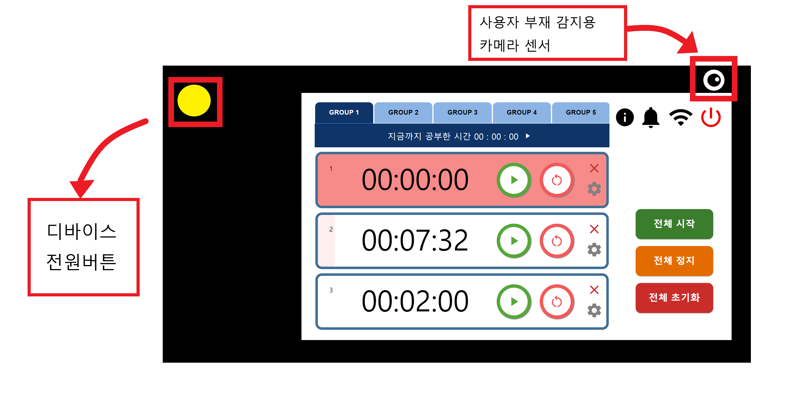

## 1.2. 디바이스 화면 설명

### 1.2.1. 그룹 이동

- 해당하는 그룹의 버튼을 눌러서 다른 타이머 그룹으로 이동 할 수 있다.

    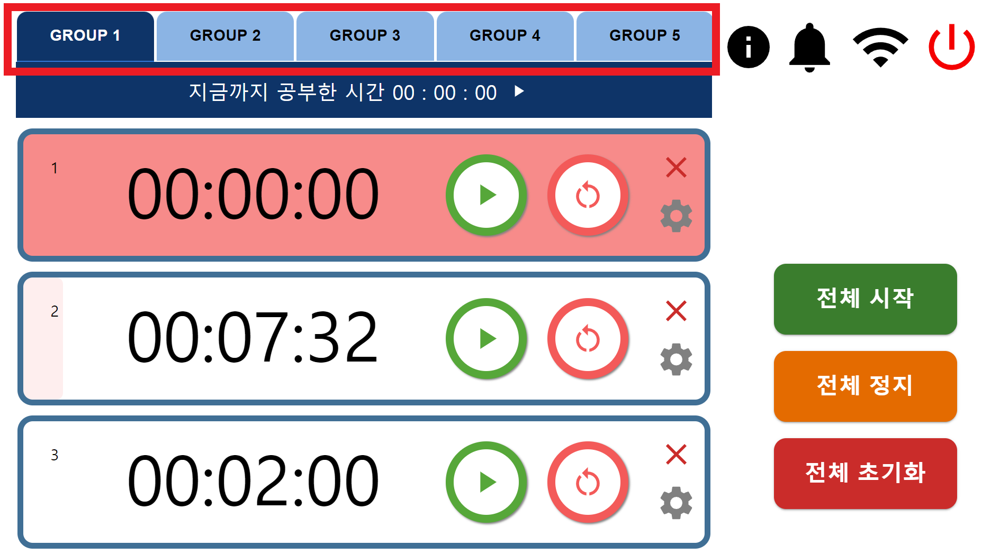
 

### 1.2.2. 순수 공부시간 확인

- 해당 그룹에서 타이머가 하나라도 동작한다면 그룹의 공부시간이 올라간다.

    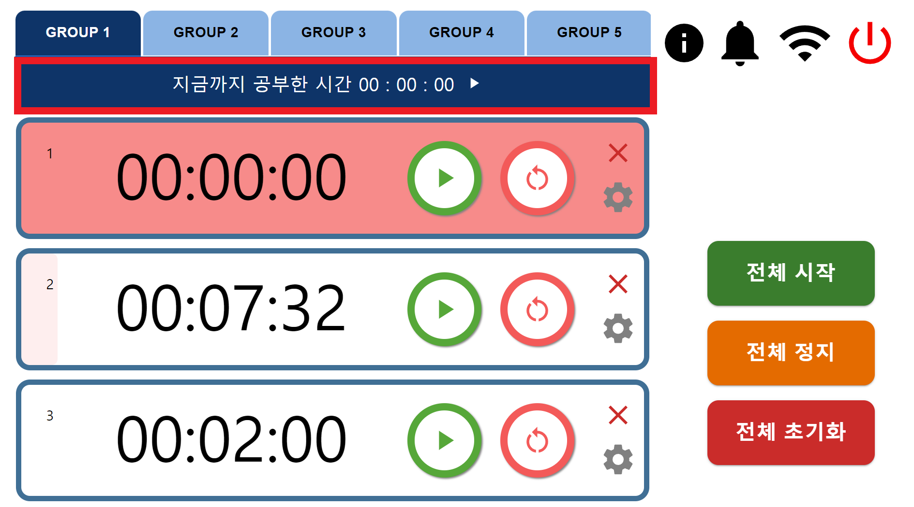

### 1.2.3. 타이머 동작 관련

- 타이머는 서로 독립적으로 작동하며, 버튼을 통해 동작 시킬 수 있다.
- 타이머는 한번에 멈추거나 초기화 하거나 정지시킬 수 있다.

    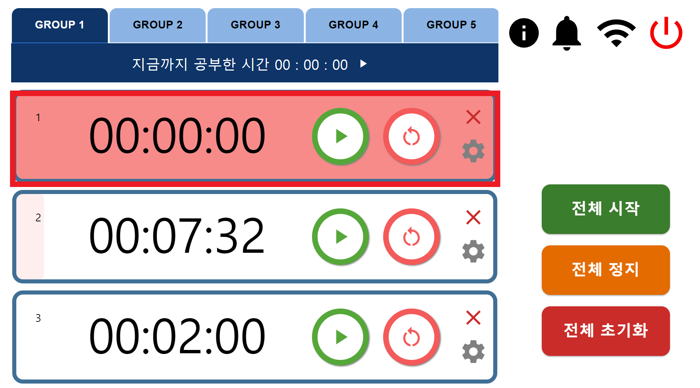

    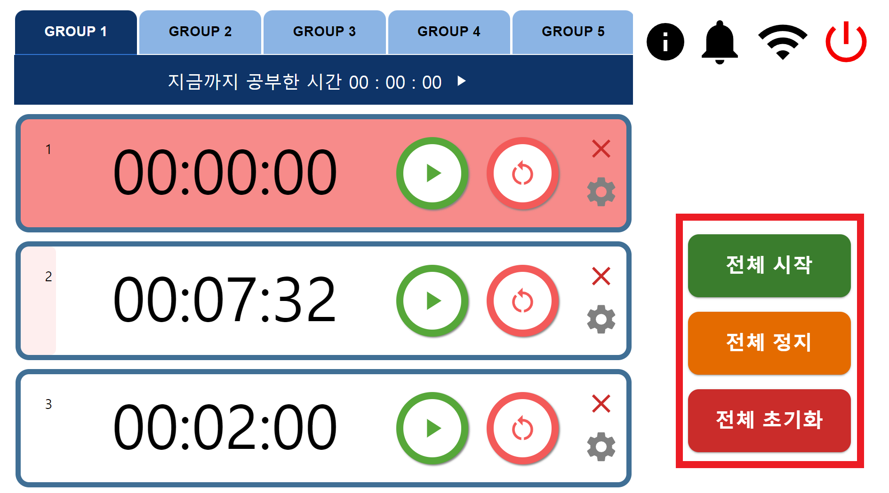

### 1.2.4. 타이머 생성 및 삭제 관련

- CREATETIMER 버튼을 눌러 타이머를 생성한다.
- X 버튼을 눌러 타이머를 삭제
    
    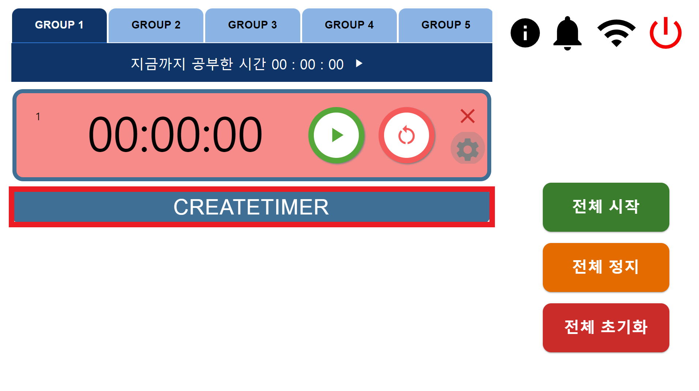
    
    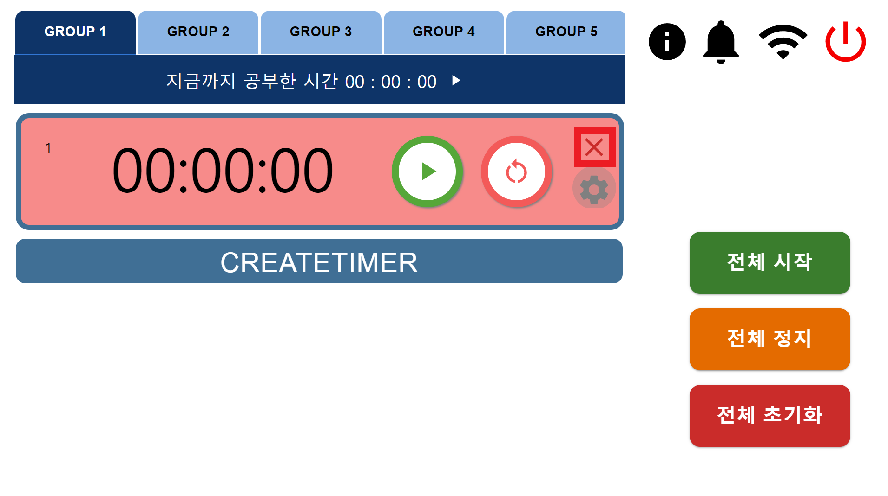
    

### 1.2.5. 타이머 시간 설정하기

- 톱니바퀴 버튼을 누르면 시간을 설정할 수 있는 스와이퍼 창이 나타난다.

    

    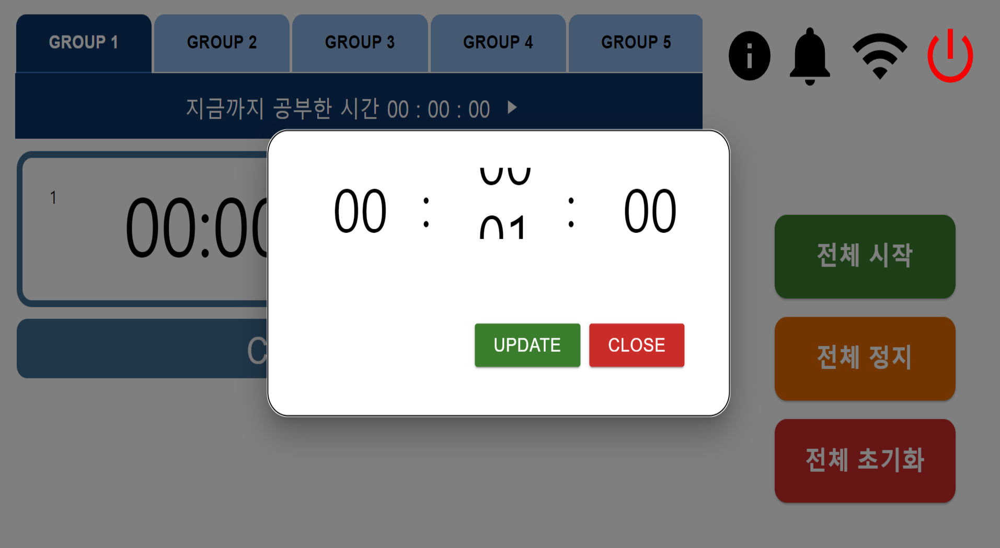

### 1.2.6. 환경설정하기

- 좌측 첫번째부터 Device 일련번호 확인, 부저알림 온오프, 와이파이 연결 , 전원 끄기
    
    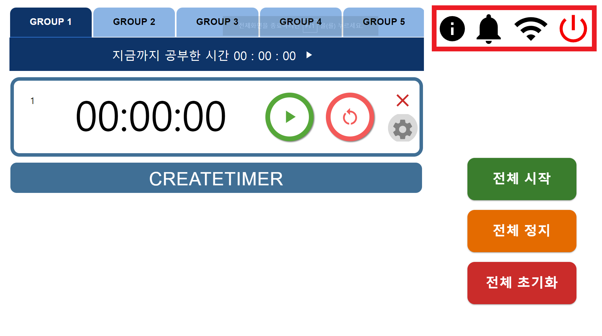
    

# 2 . 웹 페이지

## 2.1. 로그인 페이지

- 네이버, 카카오 ,구글 소셜 로그인이 가능하다.
    
    

## 2.2 회원가입 페이지

- 아이디,비밀번호,이메일을 입력해서 회원가입이 가능하다.
    
    
    

## 2.3 비밀번호 찾기 페이지

- 메일 인증을 통해 비밀번호를 변경할 수 있다.
    
    
    
    
    

## 2.4. 웹 - 디바이스 연동 페이지

- 디바이스에서 조회할 수 있는 일련번호를 입력해야 서비스 이용이 가능하다
- 한번 등록하면 다시 입력하지 않아도 된다

    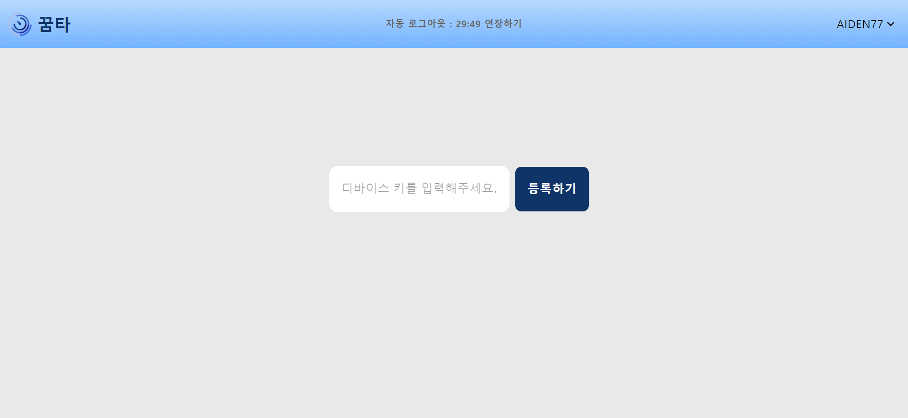

## 2.5 통계 페이지

- 모든그룹 한번에 보기, 그룹별 조회, 하루단위 조회 월단위 조회를 지원한다.
- 잔디그래프로 연단위 공부시간을 확인가능하고 커서를 올리면 공부시간 상세조회가 가능하다.

    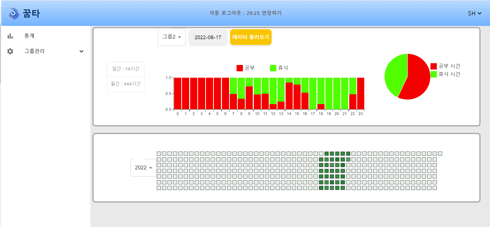

## 2.6 타이머 설정 페이지

- 2,3,4,5 타이머그룹에서의 타이머 세팅을 타이머 설정페이지에서 할 수 있다.
    
    
    

## 2.7 마이페이지

- 마이페이지에서 디바이스 일련번호를 새로 등록하거나, 등록여부를 확인 할 수 있다.
    
    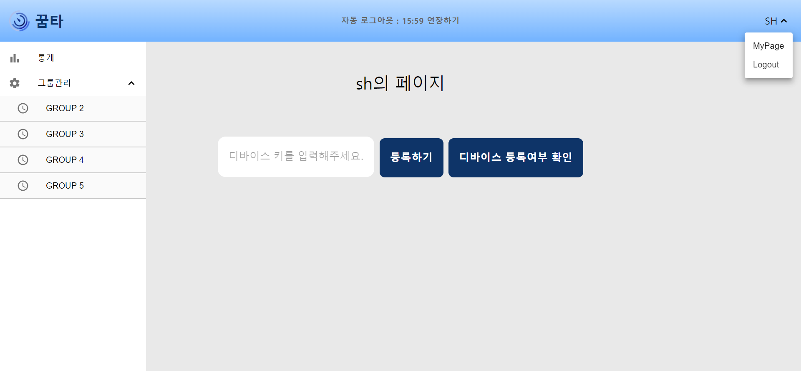

## 2.8 자동로그아웃 연장

- 자동로그아웃 버튼을 누르면 access 토큰을 재발행 해준다.
    
    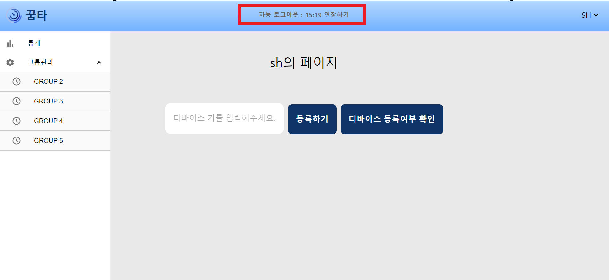
